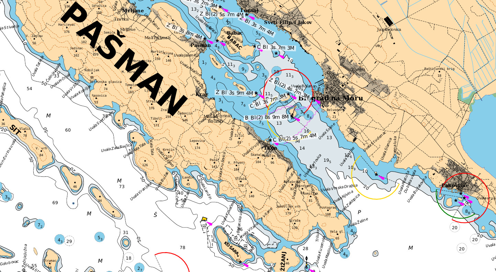

# Smrender

A rule-based renderer for OSM data.

## Description

Smrender is a powerful, flexible, and modular rule-based data processing and rendering engine for
OSM data. It is mainly intended to create paper charts for print-out but it can
be used for a lot of other tasks as well. Because of its very generic
and modular software design it is perfectly suitable for complex OSM data
processing and manipulation tasks such as filtering, modification, and
statistical analysis.

You can find some charts here: [prerendered
charts](https://www.abenteuerland.at/download/smrender/charts/).  The most
accurate charts are the yellow map style charts of Croatia (updated on 29th of
April 2015), which are based on the official sheet lines: [Croation sea
charts](https://www.abenteuerland.at/download/smrender/charts/croatia/yellow_map/PDF/).
You can find some other examples here: [chart
samples](https://www.abenteuerland.at/download/smrender/samples/).



## Download

The latest releases are found here in [Github releases section](https://github.com/rahra/smrender/releases).
Older Source packages are also found at
[current/](https://www.abenteuerland.at/download/smrender/current/) directory.

With February 2016, the primary project page of Smrender was moved to
[Github](https://github.com/rahra/smrender). The old page is found at
[Abenteueland](http://www.abenteuerland.at/smrender/) which I will keep up for
a while.

Even older versions of Smrender have been moved to the [archive/](https://www.abenteuerland.at/download/smrender/archive/) directory.

## Documentation

The latest documentation is found in the [doc/
folder](https://github.com/rahra/smrender/tree/master/doc) of the source
repository. You directly view it [here as HTML
page](https://htmlpreview.github.io/?https://github.com/rahra/smrender/blob/master/doc/smrender.html)
or [here as PDF
document](https://github.com/rahra/smrender/raw/master/doc/smrender.pdf).

## Compile and Install

If Smrender shall be used only for data manipulations, it does not have any
dependencies. But if used to produce charts which is the most common case,
Smrender depends on the following packages which have to be installed before
compilation:
`libcairo-dev`, `librsvg2-dev`, `libjpeg-turbo-dev` (or `libjpeg-dev` alternatively)

To compile and install from the tarball:
```Shell
./configure
make
make install
```

If it was checked out from GIT run `/autoconf.sh` first (you have to
have the *GNU Autotools* installed in this case.).

See documentation for more information.

## Notes

Smrender is basically in a pretty mature state but since it being a one-man
project there would be of course a lot of improvements. The main task which
bothers me the most at the moment is multi-threading which would speed a
processing a lot with modern CPUs.

Use option `-x` to speed up the loading process of the OSM source, specifically
if you are dealing with large input files. This creates an index at the 1st run
which will be pulled in at subsequent runs at a signifficantly higher speed than
parsing the raw OSM data.

Basically multi-threading is implemented but it requires for each action
function to be thread-safe by itself. This is true for many of the functions
but unfortunately not for the actual graphics rendering functions since Cairo
graphics by itself is not thread-safe. This means that these functions have to
be adapted. I did this partially but not for the most time-consuming once such
as rendering captions with auto-rotation. Actually I could not yet find out
where it clashes but I'm on the hunt.

Smrender is an open source project so I appreciate help from everybody out there ;)

## Author

Smrender is developed and maintained by Bernhard R. Fischer, 4096R/8E24F29D <bf@abenteuerland.at>.
You may also [follow me on Twitter](http://twitter.com/_Rahra_).

## License

Smrender is released under GNU GPLv3.


